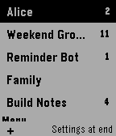
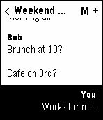
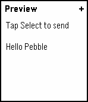
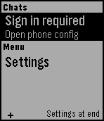

# tg

## For Users

tg is an unofficial Telegram client for Pebble watches. Read your Telegram messages on-wrist and send replies using dictation through the Pebble companion-hosted config flow.

## For Developers

This repo contains the Pebble watch app, PKJS Telegram client, hosted config page, emulator test harness, and CI workflows for Pages and public `.pbw` builds. Run `npm run test:pre-release` for the full local gate, `npm run build:watch` for a package build, and use [docs/publishing.md](./docs/publishing.md) plus the implementation docs under [docs/implementation](./docs/implementation) for the build, test, and release details.
