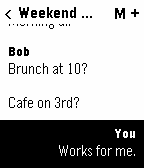
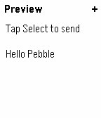
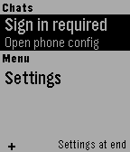
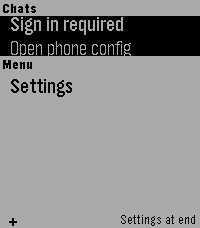
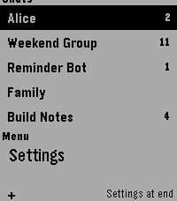
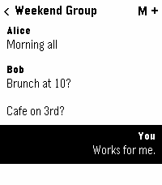
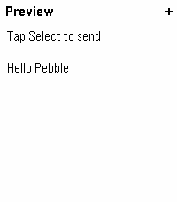
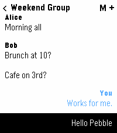

# tg App Store Listing

## Listing Metadata

- Name: `tg`
- Version: `0.1`
- Category: `Messaging`
- Release: `Public`
- Support Email: `nick.b.ludwig@proton.me`
- Source: `https://github.com/nick1udwig/tg-pebble`

## App Icon

Use [`assets/tg-pebble-icon.png`](../assets/tg-pebble-icon.png) for the store icon submission.

## Listing Text

Read your Telegram messages and send Telegram messages using dictation.

## Example Screens

1. Chat list

2. Chat open

3. Dictation preview

4. Dictation sent

5. Sign-in required

## Emery Screens

1. Sign-in required

2. Chat list

3. Chat open

4. Dictation preview

5. Dictation sent

